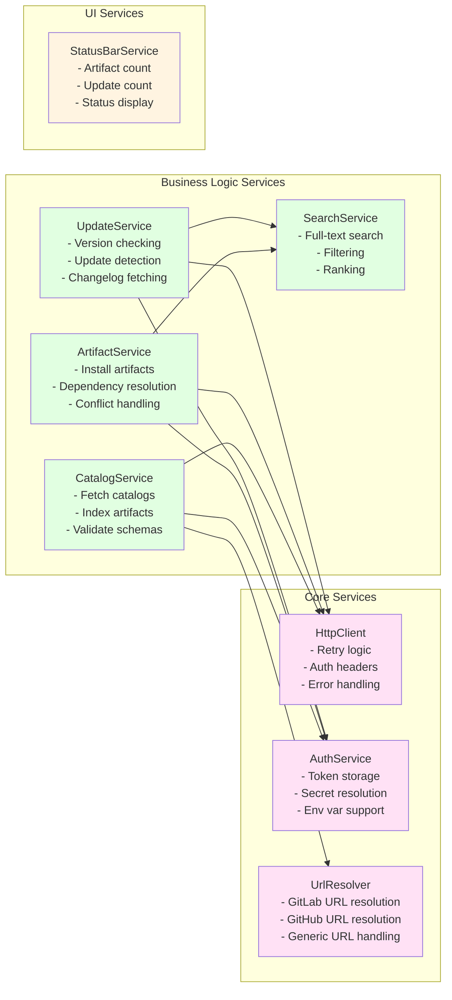
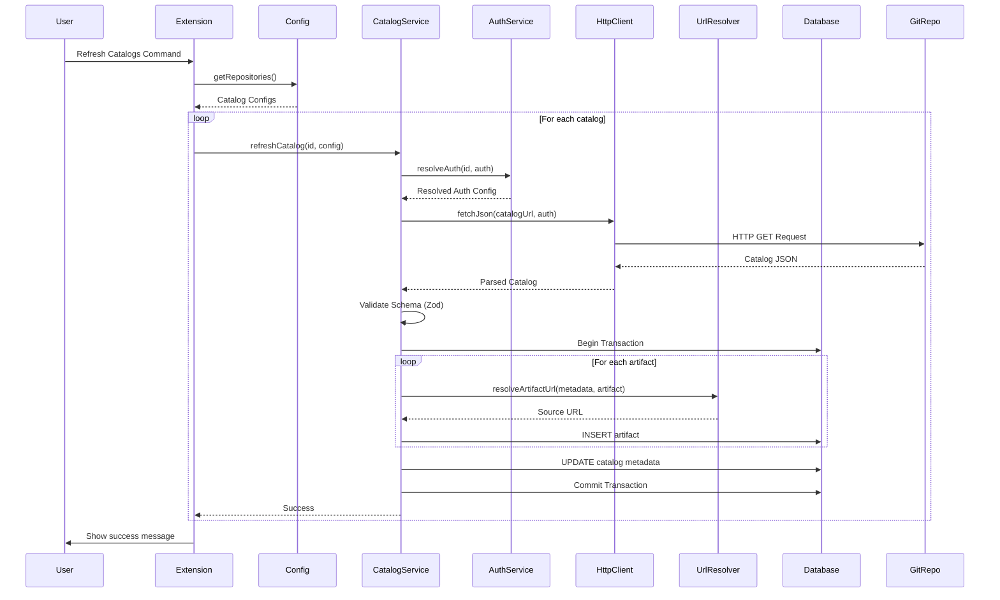
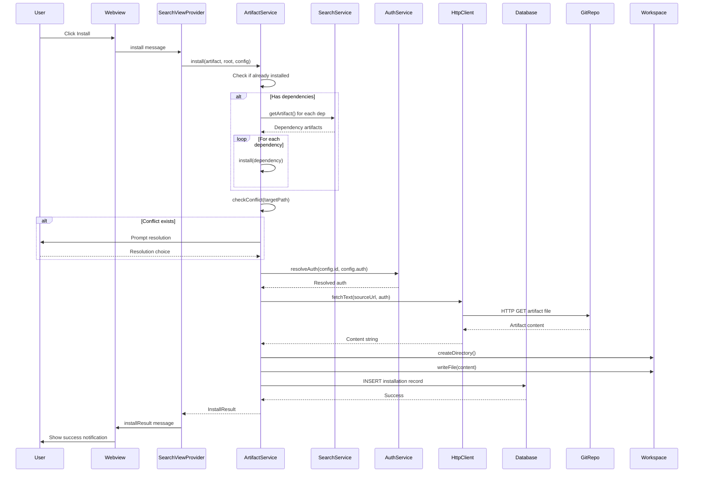
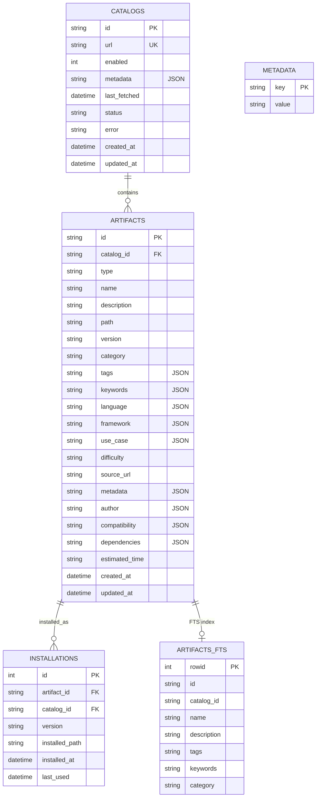
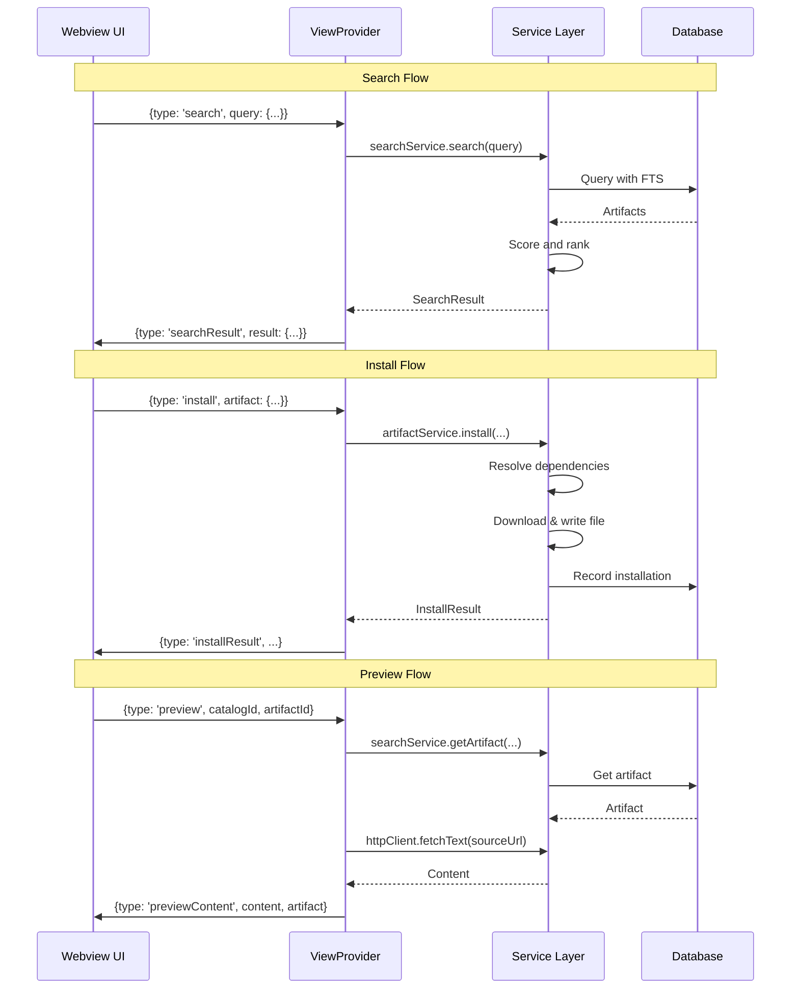
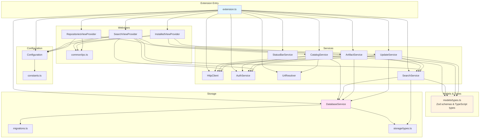
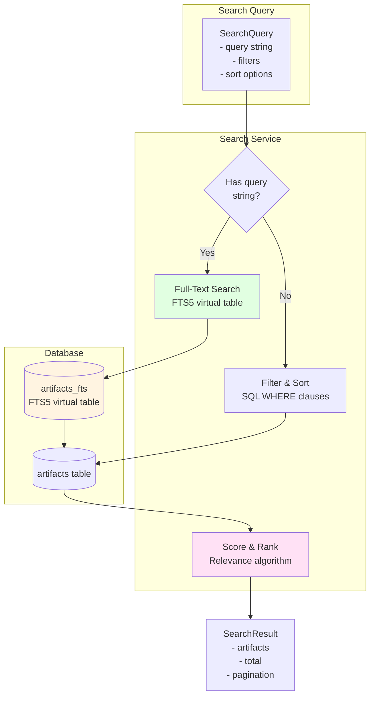
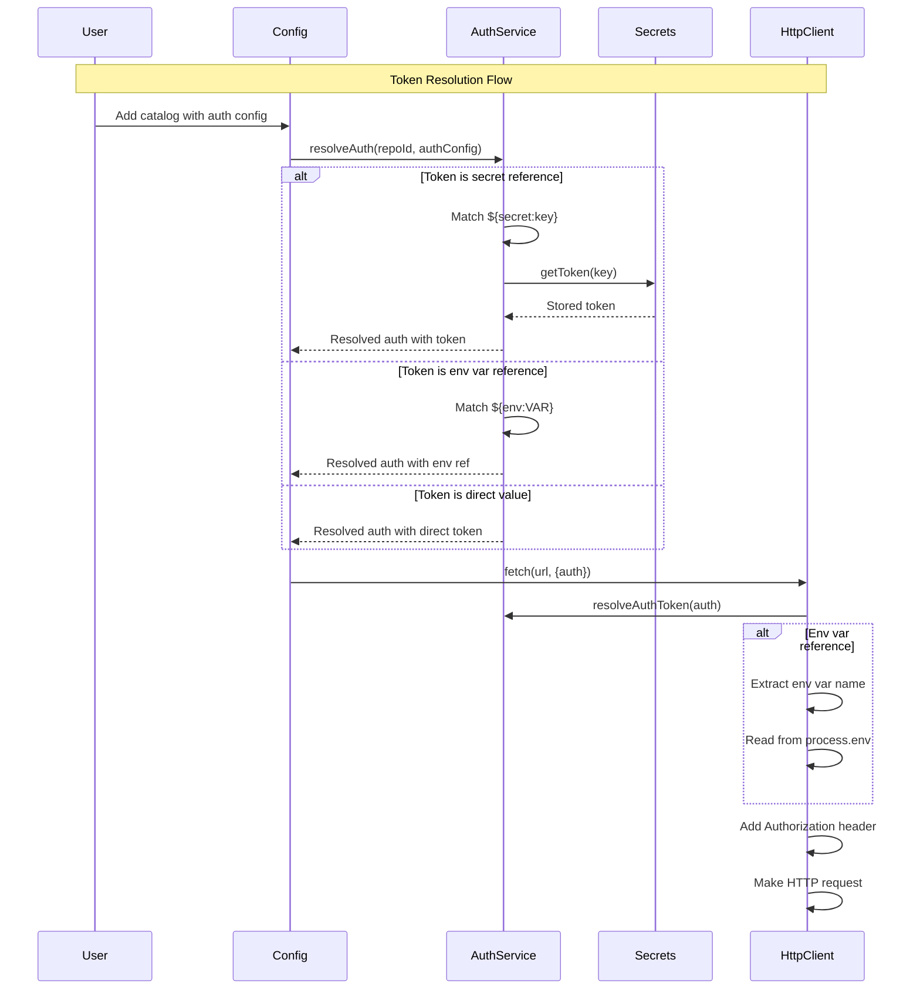
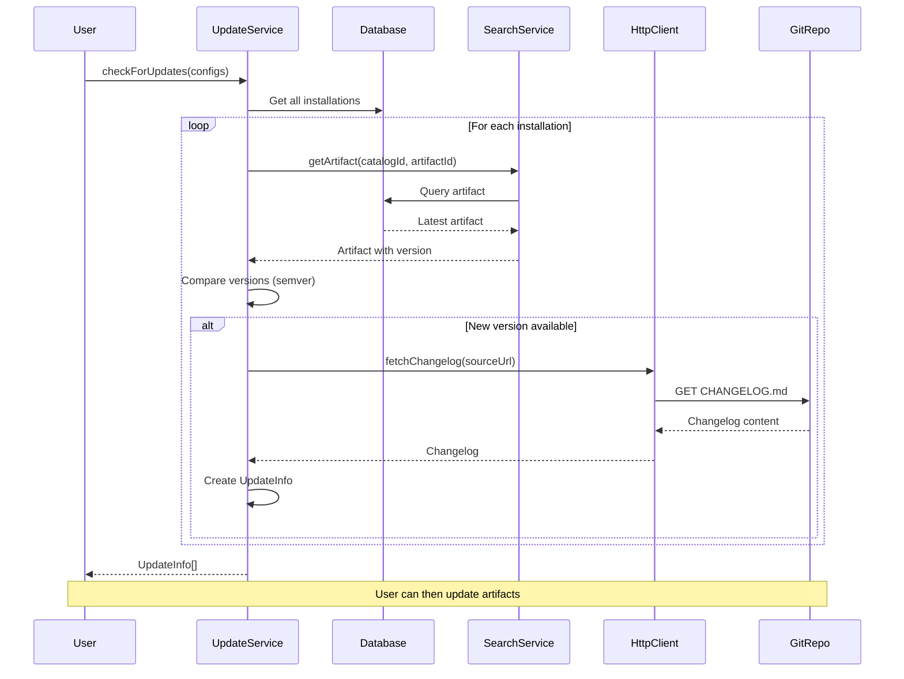

# Artifact Hub - Architecture Documentation

## Overview

Artifact Hub is a VS Code extension that provides a marketplace for AI development artifacts (chat modes, prompts, instructions, tasks, and profiles). It allows users to discover, install, and manage artifacts from multiple Git-based catalog repositories.

## High-Level Architecture

```mermaid
graph TB
    subgraph "VS Code Extension Host"
        EXT[Extension Entry Point<br/>extension.ts]

        subgraph "Configuration Layer"
            CONFIG[Configuration Service]
        end

        subgraph "Service Layer"
            HTTP[HttpClient]
            AUTH[AuthService]
            URL[UrlResolver]
            CAT[CatalogService]
            SEARCH[SearchService]
            ART[ArtifactService]
            UPDATE[UpdateService]
            STATUS[StatusBarService]
        end

        subgraph "Storage Layer"
            DB[(SQLite Database<br/>better-sqlite3)]
            MIGRATIONS[Migrations]
        end

        subgraph "Webview Layer"
            SEARCH_VIEW[SearchViewProvider]
            INSTALLED_VIEW[InstalledViewProvider]
            REPO_VIEW[RepositoriesViewProvider]
        end

        subgraph "UI Layer"
            SEARCH_HTML[search.html]
            INSTALLED_HTML[installed.html]
            REPO_HTML[repositories.html]
            SEARCH_JS[search/index.ts]
            INSTALLED_JS[installed/index.ts]
            REPO_JS[repositories/index.ts]
        end
    end

    subgraph "External"
        GITLAB[GitLab Repositories]
        GITHUB[GitHub Repositories]
        WORKSPACE[VS Code Workspace]
        VSCODE_API[VS Code API]
    end

    EXT --> CONFIG
    EXT --> HTTP
    EXT --> AUTH
    EXT --> URL
    EXT --> CAT
    EXT --> SEARCH
    EXT --> ART
    EXT --> UPDATE
    EXT --> STATUS
    EXT --> DB
    EXT --> SEARCH_VIEW
    EXT --> INSTALLED_VIEW
    EXT --> REPO_VIEW

    CONFIG --> VSCODE_API
    AUTH --> VSCODE_API
    DB --> MIGRATIONS

    HTTP --> GITLAB
    HTTP --> GITHUB

    CAT --> HTTP
    CAT --> URL
    CAT --> AUTH
    CAT --> DB

    SEARCH --> DB
    ART --> DB
    ART --> HTTP
    ART --> AUTH
    ART --> SEARCH
    UPDATE --> DB
    UPDATE --> SEARCH
    UPDATE --> HTTP
    UPDATE --> AUTH

    SEARCH_VIEW --> SEARCH_HTML
    SEARCH_VIEW --> SEARCH_JS
    INSTALLED_VIEW --> INSTALLED_HTML
    INSTALLED_VIEW --> INSTALLED_JS
    REPO_VIEW --> REPO_HTML
    REPO_VIEW --> REPO_JS

    ART --> WORKSPACE
    STATUS --> VSCODE_API

    style EXT fill:#e1f5ff
    style DB fill:#fff4e1
    style HTTP fill:#ffe1f5
    style SEARCH fill:#e1ffe1
```



## Service Layer Architecture



## Data Flow: Catalog Refresh



## Data Flow: Artifact Installation



## Database Schema

> **Note**: The `ARTIFACTS` table uses a composite primary key `(id, catalog_id)` in the actual database, but Mermaid ER diagrams don't support composite keys directly. The diagram shows `id` as PK and `catalog_id` as FK.



## Webview Communication Flow



## Component Dependencies



## Search Architecture



## Authentication Flow



## Update Detection Flow



## File Structure

```
extension/
├── src/
│   ├── extension.ts              # Entry point, service initialization
│   ├── config/
│   │   ├── configuration.ts      # VS Code config wrapper
│   │   └── constants.ts          # Constants and defaults
│   ├── models/
│   │   └── types.ts              # Zod schemas & TypeScript types
│   ├── storage/
│   │   ├── Database.ts           # SQLite database wrapper
│   │   ├── migrations.ts         # Database migrations
│   │   └── types.ts              # Database row types
│   ├── services/
│   │   ├── HttpClient.ts         # HTTP client with retry logic
│   │   ├── AuthService.ts        # Authentication & secrets
│   │   ├── UrlResolver.ts        # Git URL resolution
│   │   ├── CatalogService.ts    # Catalog management
│   │   ├── SearchService.ts     # Search & filtering
│   │   ├── ArtifactService.ts   # Installation & management
│   │   ├── UpdateService.ts     # Update detection
│   │   └── StatusBarService.ts  # Status bar UI
│   └── webview/
│       ├── common/
│       │   └── ipc.ts            # IPC message types
│       ├── SearchViewProvider.ts
│       ├── InstalledViewProvider.ts
│       ├── RepositoriesViewProvider.ts
│       ├── search/index.ts       # Webview frontend
│       ├── installed/index.ts
│       └── repositories/index.ts
├── media/                        # HTML templates & CSS
├── dist/                         # Compiled output
└── package.json                  # Extension manifest
```

## Key Design Patterns

### 1. **Service Layer Pattern**
- Clear separation of concerns
- Services are dependency-injected
- Single responsibility principle

### 2. **Repository Pattern**
- Database abstraction through DatabaseService
- Transaction support
- Migration system

### 3. **Provider Pattern**
- Webview providers handle UI lifecycle
- Message-based communication
- Separation of extension host and webview

### 4. **Schema Validation**
- Zod schemas for runtime validation
- Type safety with TypeScript
- Clear error messages

### 5. **Full-Text Search**
- FTS5 virtual table for performance
- Triggers to keep FTS in sync
- Relevance scoring algorithm

## Technology Stack

- **Runtime**: Node.js (VS Code Extension Host)
- **Language**: TypeScript
- **Database**: SQLite (better-sqlite3)
- **Validation**: Zod
- **Build**: esbuild
- **UI**: VS Code Webview API + HTML/CSS/JS
- **Versioning**: semver

## Data Flow Summary

1. **Catalog Management**: User adds catalog → Fetch → Validate → Index → Store in DB
2. **Search**: User queries → FTS/Filter → Rank → Return results
3. **Installation**: User installs → Resolve deps → Download → Write file → Record in DB
4. **Updates**: Periodic check → Compare versions → Notify user
5. **Authentication**: Config → Resolve secrets/env → Add headers → HTTP request

