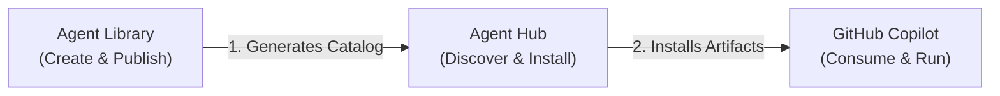

# Agent Hub

> **Discover, install, and manage AI development artifacts from any Git platform**

Agent Hub is a VS Code extension that provides a marketplace for AI development artifacts (chat modes, prompts, instructions, tasks, profiles, and agent packs). Install artifacts with one click from GitHub, GitLab, or any Git platform.

## Using with Agent Library



Agent Library is a companion scaffold for publishing catalogs of artifacts (chatmodes, prompts, instructions, tasks) and hosting a browsable frontend. Use Agent Library to generate your `copilot-catalog.json`, then add that URL in Agent Hub to search and install artifacts in VS Code.

- **Example Catalog Site:** [https://nimeshgurung.github.io/agent-library/](https://nimeshgurung.github.io/agent-library/)
- Agent Library repo: `https://github.com/nimeshgurung/agent-library` (see `docs/quickstart.md`)
- Marketplace page for this extension: `https://marketplace.visualstudio.com/items?itemName=nimsbhai.agent-hub`

Typical flow:
1. In Agent Library: generate artifacts and `copilot-catalog.json` (GitHub/GitLab raw or frontend-hosted).
2. In VS Code: Install Agent Hub and add your catalog URL (see “Managing Catalogs”).
3. Search, preview, and install artifacts into your repository.

**Example Settings:**
```json
{
  "agentHub.repositories": [
    {
      "id": "agent-library",
      "url": "https://nimeshgurung.github.io/agent-library/copilot-catalog.json",
      "enabled": true
    }
  ]
}
```

Browse the catalog at [https://nimeshgurung.github.io/agent-library/](https://nimeshgurung.github.io/agent-library/) to see a live React frontend example.

More details: see [`docs/with-agent-library.md`](docs/with-agent-library.md).

## Features

### 🔍 Universal Search
- Search across multiple catalog repositories
- Filter by type, language, framework, category, and difficulty
- Full-text search with intelligent ranking
- Preview artifacts before installing

### 📦 One-Click Installation
- Install artifacts directly into your workspace
- Automatic dependency resolution
- Conflict detection and resolution
- Update notifications
- Support for complex agent packs that install multiple agents/prompts/config files in one shot

### 🔐 Private Catalogs
- Support for private repositories
- Bearer token and PAT authentication
- Environment variable support
- Secure credential storage

### 👥 Team Collaboration
- Share organization catalogs
- Standardize AI workflows across teams
- Profile agent packs for quick setup

## Getting Started

### Installation

1. Install the extension from the VS Code Marketplace
2. Click the Agent Hub icon in the Activity Bar
3. Add a catalog repository

### Managing Catalogs

#### Adding a Catalog

Click **Add Repository** in the Repositories view and enter:
- **URL**: Raw URL to `copilot-catalog.json`
- **ID**: Unique identifier (auto-generated)
- **Auth** (optional): For private repositories

**Example URLs:**
```
GitHub:  https://raw.githubusercontent.com/org/repo/main/copilot-catalog.json
GitLab:  https://gitlab.com/org/repo/-/raw/main/copilot-catalog.json
```

#### Removing a Catalog

You can remove a catalog in two ways:

1. **From the Repositories view**: Click the **Remove** button on any repository card
2. **From the Command Palette**: Run `Agent Hub: Remove Repository` and select from the list

When you remove a repository, the extension will:
- Prompt for confirmation if there are installed artifacts from that repository
- Automatically delete all installed artifacts from that repository
- Clean up all database records and metadata
- Update your workspace settings

### Installing Artifacts

1. Search for artifacts in the Search view
2. Click **Preview** to view details
3. Click **Install** to add to your workspace
4. Standard artifacts (chatmodes, prompts, instructions, tasks) are installed under `.github/` by default
5. **Agent Packs** are installed with a hidden definition file under `.github/.agent-hub/agents/<id>/`, while their resources are projected into your workspace root:
   - Files under `resources/.github/agents` → `.github/agents/`
   - Files under `resources/.github/prompts` → `.github/prompts/`
   - `.vscode/settings.json` (if shipped) → `.vscode/settings.json` at workspace root
   - Other resources (like `.specify/`) are projected to the workspace root

## Catalog Format

Create your own catalog with a `copilot-catalog.json` file:

```json
{
  "version": "1.0.0",
  "catalog": {
    "id": "my-catalog",
    "name": "My Catalog",
    "description": "My custom artifacts",
    "author": {
      "name": "Your Name"
    },
    "repository": {
      "type": "github",
      "url": "https://github.com/user/repo",
      "branch": "main"
    },
    "license": "MIT"
  },
  "artifacts": [
    {
      "id": "my-chatmode",
      "type": "chatmode",
      "name": "My Chat Mode",
      "description": "Description of the chat mode",
      "path": "chatmodes/my-chatmode.chatmode.md",
      "version": "1.0.0",
      "category": "Development",
      "tags": ["typescript", "expert"],
      "dependencies": []
    }
  ]
}
```

See [`examples/sample-catalog.json`](examples/sample-catalog.json) for a complete example.

## Configuration

### Settings

- `agentHub.repositories`: List of configured catalog repositories
- `agentHub.autoUpdate`: Automatically check for catalog updates (default: `true`)
- `agentHub.updateInterval`: Update check interval in seconds (default: `3600`)
- `agentHub.installRoot`: Root directory for installations (default: `.github`)

### Commands

- `Agent Hub: Search Artifacts` - Open search view
- `Agent Hub: View Installed Artifacts` - View installed artifacts
- `Agent Hub: Add Repository` - Add a new catalog
- `Agent Hub: Remove Repository` - Remove a catalog and its installed artifacts
- `Agent Hub: Refresh Catalogs` - Refresh all catalogs

## Authentication

### Personal Access Token (GitLab/GitHub)

1. Generate a PAT with `read_repository` scope
2. When adding a catalog, check "Requires Authentication"
3. Enter your token when prompted
4. Tokens are stored securely in VS Code

### Environment Variables

Reference environment variables in your settings:

```json
{
  "agentHub.repositories": [
    {
      "id": "private-catalog",
      "url": "https://gitlab.company.com/...",
      "auth": {
        "type": "bearer",
        "token": "${env:GITLAB_TOKEN}"
      }
    }
  ]
}
```

## Artifact Types

- **Chat Modes** (`.chatmode.md`): Installed to `.github/chatmodes/`
- **Instructions** (`.md`): Installed to `.github/instructions/`
- **Prompts** (`.md`): Installed to `.github/prompts/`
- **Tasks** (`.md`): Installed to `.github/tasks/`
- **Profiles** (`.json`): Logical collections that reference other artifacts
- **Agent Packs** (directory-based): Hidden definition at `.github/.agent-hub/agents/<id>/README.md` plus all declared `supportingFiles` projected into the workspace root (agents, prompts, templates, scripts, etc.), with `.vscode/settings.json` applied at the workspace root

## Contributing

We welcome contributions! Please see our [Contributing Guide](CONTRIBUTING.md).

### Development Setup

```bash
cd extension
npm install
npm run watch
```

Press `F5` to launch the Extension Development Host.

## Publishing

1. Bump the `version` in `package.json` and commit your changes.
2. Run the quality gates:
   ```bash
   npm run lint && npm run typecheck && npm test
   ```
3. Build and package a `.vsix` artifact (written to `artifacts/<name>-<version>.vsix` and echoed after completion):
   ```bash
   npm run package:vsix
   ```
4. Publish the extension to the Visual Studio Code Marketplace (the script automatically loads `VSCE_PAT` from `.env` via `dotenv-cli`):
   ```bash
   npm run publish:marketplace
   ```

The `publish:marketplace` script uses `vsce` under the hood and injects `VSCE_PAT` from `.env`, so you can store the token once and keep publishing repeatable. You can still run `npx vsce login nimsbhai` if you prefer the interactive flow. See the [VS Code publishing guide](https://code.visualstudio.com/api/working-with-extensions/publishing-extension) for additional options (pre-releases, platform-specific VSIX files, and automation tips).

## License

MIT © Artifact Hub

## Support

- 📖 [Documentation](https://github.com/nimeshgurung/agent-hub/tree/main/docs)
- 💬 [Discussions](https://github.com/nimeshgurung/agent-hub/discussions)
- 🐛 [Issue Tracker](https://github.com/nimeshgurung/agent-hub/issues)

---

**Enjoy using Artifact Hub!** ⭐

## Screenshots (placeholders)
- Repositories view with an Agent Library catalog added (docs/images/repos-view.png)
- Search results showing multiple artifacts (docs/images/search-results.png)
- Artifact detail with one-click install (docs/images/artifact-detail.png)

